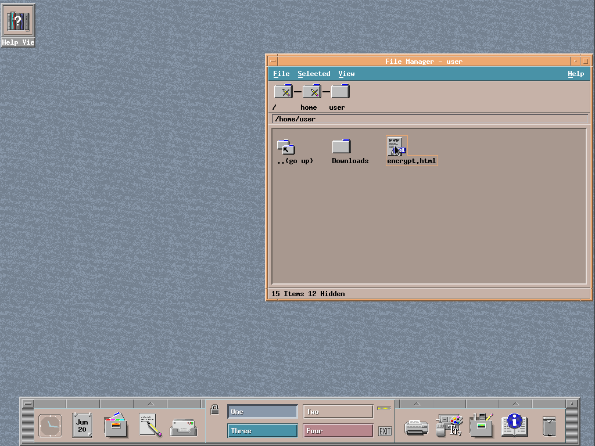

# 🔒 Secure File Sharing Utility 🔒

Welcome to our secure file sharing utility! This HTML-based tool allows you to
easily encrypt, share, and decrypt files using the CMS (Cryptographic Message
Syntax) standard, PWRI (password recipient info) and AES-256-GCM encryption.

## 🔐 Features

-   **Encrypt Files**: Select a file, enter a password, and the tool will generate
    a standalone HTML file that contains the encrypted data.
-   **Share Securely**: Share the generated HTML file with your recipient, who can
    then decrypt the file using the same password.
-   **Decrypt Files**: The recipient can use the standalone HTML file to decrypt
    the CMS payload and access the original file.
-   **Local Processing**: All encryption and decryption operations are performed
    locally in the browser, ensuring your data never leaves your device.
-   **Standalone HTML**: The encrypted and decrypted files are self-contained HTML
    files, making them easy to share and use.
-   **AES-256-GCM**: The utility uses the secure AES-256-GCM cipher to encrypt
    your files, providing strong protection for your data.
-   **Standards-based**: By using the CMS standard, this tool avoids "reinventing
    the wheel" and allows interoperability with other file encryption tools.
-   **No Installation Required**: This utility can be used directly in your web
    browser, without the need for any additional software installation.

## 🚀 Getting Started

Using this secure file sharing utility is simple:

1. **Encrypt a File**:

    - Open the HTML file in your browser.
    - Select the file you want to encrypt.
    - Enter a password to protect the file.
    - Click the "&#x1f4be;&#xfe0e; Save" button.
    - The tool will generate a new HTML file containing the encrypted data.

2. **Share the Encrypted File**:

    - Share the generated HTML file with your recipient.

3. **Decrypt the File**:
    - Your recipient can open the HTML file in their browser.
    - They will be prompted to enter the password you provided and will need to
      click on the "Next &#x2192;" button to decrypt the file and confirm details
      before downloading.
    - Clicking on the "&#x1f4be;&#xfe0e; Download" button will download the
      original file.

That's it! Your file is now securely shared, and the recipient can access the
decrypted content.

## 🎥 Demo

Want to see how it works? Check out the live demo at
<https://cms-sfx-demo.exact.realty>.

## 🔒 Security Considerations

This utility is designed with security in mind. By using the CMS standard, PWRI,
and AES-256-GCM encryption, your files are protected during the sharing process.
Additionally, all encryption and decryption operations are performed locally in
the browser, so your data never leaves your device.

**Password Strength Matters**: The strength of the encryption and overall
security of this tool _greatly_ depend on the strength of the password you
choose. We recommend using a strong, unique password to protect your files.
Weak or compromised passwords can put your data at risk.

## ❗️ Disclaimer

This tool is provided in the hope that it will be helpful, but it comes with
absolutely no warranty, to the maximum extent permitted by law. While we have
taken great care to design this utility with security in mind, the
responsibility for the security and proper use of this tool lies entirely with
the user.

We cannot guarantee that this tool will be free from bugs, vulnerabilities, or
other issues that could compromise the security of your data. The strength of
the encryption and the overall security of this tool ultimately depend on
factors outside of our control, such as the strength of the password you choose,
the security of your web browser, and the overall security of your computing
environment.

**By using this tool, you acknowledge and agree that, to the maximum extent
permitted by law, we make no representations or warranties, express or implied,
including but not limited to the warranties of merchantability, fitness for a
particular purpose and noninfringement. Please refer to the license for
additional details.**

It is your responsibility to thoroughly evaluate the risks and benefits of using
this tool, and to take appropriate measures to ensure the security of your data.
We strongly recommend that you carefully review the source code, perform your
own security audits, and seek the advice of security professionals before
relying on this tool for any sensitive or critical data.

## 📝 Contributing

We welcome contributions to this project! If you have any ideas, bug reports,
or feature requests, please feel free to submit them.

## 📜 License

This project is licensed under the Apache 2.0 License with the LLVM exception.
You are free to use this package in compliance with the terms of the license.
For more information, see the `LICENSE` file.

We hope you find this secure file sharing utility useful! If you have any
questions or feedback, please don't hesitate to reach out.
